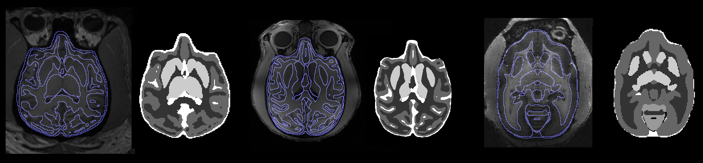
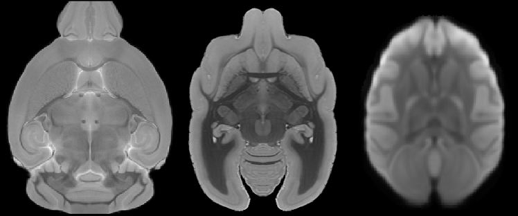

Segment Brain Images using Built-in Models
------------------------------------------



This documentation describes the steps to segment brain images using the built-in models in the program. Follow the instructions below to segment your animal data.

### Step 1: Specify Input


Select the NIFTI files (.nii, .nii.gz) of the animal data as the input for the program. Make sure the images are axial images of the brain, as shown in the example images below for rhesus and rodent brains.



Ensure that the orientation is correct, or the segmentation may fail.

### Step 2: Configure Network


Choose a built-in model from the droplist or load a model file using the folder button. The built-in models are stored as .net.gz files in the *network* folder of the program.

### Step 3: Evaluate


After configuring the network, specify the pre-processing and post-processing options:

-   Pre Processing: 
    If match resolution is checked, the input image will be regridded so that the input resolution will be the same as the training data.
    If match FOV is checked, the input image will be cropped or zero-padded so that the mm length at image width/height/depth will be the same of the training data

-   Prob Threshold: The threshold used in thresholding the probability when creating the segmentation labels.
-   Output: 
    1. 3D Labels: this outputs one 3D Volume of voxel-wise segmentation.
    2. 4D probability: this outputs 4D tissue probability map. The fourther dimension represent 0:white matter, 1:gray matter (including amygdala and hippocampus), 2:cerebellum cortex, 3: basal basal ganglia, 4: others (CSF...etc.).
    3. Skull Strip: output the skull-stripped image using the tissue probability maps.
    4. U-Net Output

-   Device: Specify whether CPU or GPU is used.

### Step 4: Output

Click on the disk button to save the output.

You may check out the results for each input data 

If you experience errors or issues, please feel free to upload data using the private upload link on the website. We will modify the software to fix the problems.

## Command line interface


*example:*


Segment all NIFTI files using the t2w marmoset model and save output as skull stripped images.
```
unet-studio --action=evaluate --source=*.nii.gz --network=marmoset.t2w.seg5 --output_format=2  
```

**main input parameters**

| parameters | values |
|---|----|
|action| specify `evaluate` for evaluation use of the model|
|source| specify input image files, support wildcard like `*` |
|network| specify the network to be used. A list of available network can be found at the `network` folder|

**optional input parameters**
| parameters | default value | function | 
|---|----|
|output_format| `0` | `0`: 3D voxel wise labels `1`: 4D probability map `2`: skull stripped images `3`: brain mask only|
| prob_threshold | `0.5` | probability threshold |
| match_resolution | `1` | whether to resample input image to match the resolution of the network | 
| match_fov | `0` | whether to crop input images to match the input dimension of the network | 
    


