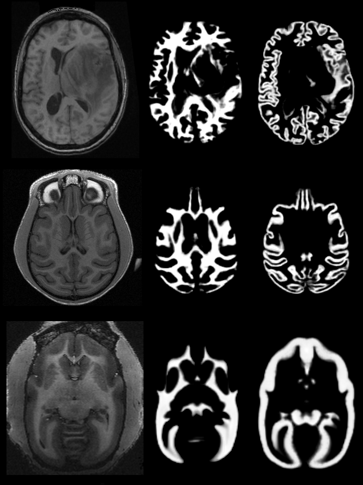

# UNet-Studio: A Brain Segmentation Software Tool for Animals
 

## Introduction

U-Net Studio is a tissue segmentation tool for human and animal brain images. It devices a unique data augmentation method that allows for using only **one template image** to train a 3D U-Net from scratches.

U-Net Studio provides highly segmentation models for mouse, rat, marmosets, rhesus monkeys, and human. These models are easily adaptable and retrainable for various imaging modalities, streamlining the segmentation process and reducing the need for manual annotation.

The currently version only provides skull-stripping, and segmentation of white matter, gray matter, cerebellum cortex and basal ganglia. More detailed segmentation is under planning. 

## Output

U-Net Studio can output 3D labels or 4D probablistic maps for quantifying tissue characteristics. The tissue segmentation includes white matter, gray matter (excluding basal ganglion), basal ganglion, and others.

## Available models

Currently available models and training data used

| Model Name | Modality | Source |
|------------|----------|--------|
| human.t1w.seg5.net.gz      | t1w      | [ICBM152 2009a t1w template](https://www.bic.mni.mcgill.ca/ServicesAtlases/ICBM152NLin2009) | 
| human.t1w.lesion.seg5.net.gz      | t1w (the same as above, no lesion image used)  | [ICBM152 2009a t1w template](https://www.bic.mni.mcgill.ca/ServicesAtlases/ICBM152NLin2009) | 
| human.t2w.seg5.net.gz      | t2w      | [ICBM152 2009a t2w template](https://www.bic.mni.mcgill.ca/ServicesAtlases/ICBM152NLin2009) | 
| rhesus.t1w.seg5.net.gz     | t1w      | [ONPRC18 t1w template](https://pubmed.ncbi.nlm.nih.gov/33137475/) | 
| rhesus.t2w.seg5.net.gz     | t2w      | [ONPRC18 t2w template](https://pubmed.ncbi.nlm.nih.gov/33137475/) | 
| marmoset.t1w.seg5.net.gz     | t1w      | [Marmoset Brain Mapping v3.0 t1w template](https://www.sciencedirect.com/science/article/pii/S1053811920311058)| 
| marmoset.t2w.seg5.net.gz     | t2w      | [Marmoset Brain Mapping v3.0 t2w template](https://www.sciencedirect.com/science/article/pii/S1053811920311058)| 
| rat.t2w.seg4.net.gz | t2w | [SIGMA wistar Rat template](https://www.nitrc.org/projects/sigma_template) | 
| mouse.t2w.seg5.net.gz | t2w, t1w | [Hikishima template](https://pubmed.ncbi.nlm.nih.gov/28273899/) | 

